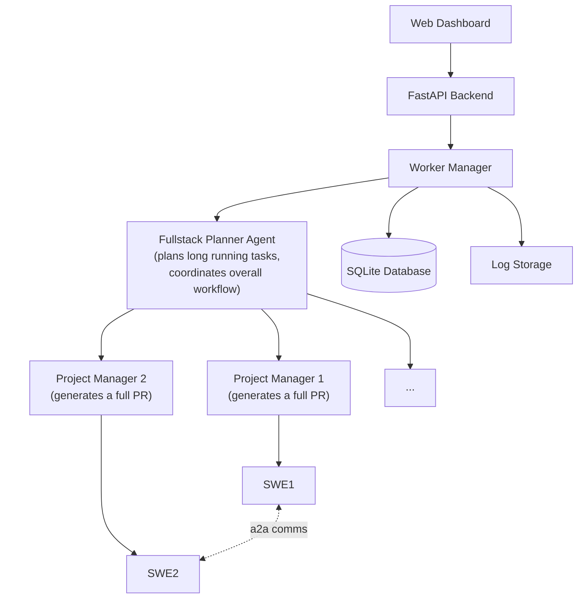

<div align="center">


*Github-integrated background agents, automating end-to-end software engineering,  fully open source.*


[](https://opensource.org/licenses/MIT)
[](https://www.python.org/downloads/)
[](https://fastapi.tiangolo.com/)
[](.github/CONTRIBUTING.md)

[🚀 Quick Start](#-quick-start) | [📖 Documentation](https://try-cairn.com) | [ Discord](https://discord.gg/C67EdrKN) | [🐛 Issues](https://github.com/cairn-dev/cairn/issues) | [🤝 Contributing](.github/CONTRIBUTING.md)

</div>

## 🪨 What is Cairn?

Cairn is a simple open-source background-agent system for coding. Think [Codex](https://openai.com/index/introducing-codex/), [Jules](https://jules.google/), or [Cursor Background Agents](https://docs.cursor.com/background-agent), but open sourced!
You can run Cairn locally, connect it to your github repos and use your favorite LLM to execute fullstack tasks, 100% in the background. Save time for the things you want to do by automating the boring stuff!


| Provider | Status | Models |
|----------|--------|---------|
| 🟢 **Anthropic** | ✅ Supported | Claude Sonnet 4, Claude Sonnet 3.7, Claude Sonnet 3.5, etc |
| 🟢 **OpenAI** | ✅ Supported | GPT-4.1, GPT-4o, GPT-4, GPT-3.5-Turbo, etc |
| 🟢 **Gemini** | ✅ Supported | Gemini 2.5 Flash, Gemini 2.5 Pro, Gemini 2.0 Flash, Gemini 1.5 Pro, etc |
| 🟡 **Deepseek** | 🚧 Coming Soon |
| 🟡 **Llama** | 🚧 Coming Soon |

## Table of Contents

- [What is Cairn?](#-what-is-cairn)
  - [Model Support](#model-support)
- [Quick Start](#quick-start)
  - [Installation](#installation)
- [Architecture Overview](#architecture-overview)
- [Development](#development)
  - [Project Structure](#project-structure)
  - [Contributing](#contributing)
- [License](#license)
- [Roadmap](#roadmap)

## Quick Start

### Installation

1. **Clone or fork the repository**
   ```bash
   git clone git@github.com:cairn-dev/cairn.git
   cd cairn
   ```

2. **Install dependencies**

   **Backend dependencies (Python):**
   ```bash
   python -m venv cairn-env
   source cairn-env/bin/activate  # On Windows: cairn-env\Scripts\activate
   pip install -r requirements.txt
   ```

   **Frontend dependencies (Node.js):**
   ```bash
   cd frontend
   npm install
   cd ..
   ```

   > **Note**: You'll need Node.js (version 16 or higher) and npm installed on your system.

3. **Set up github access**

   Cairn uses a self-hosted GitHub app (which you own and control) with read/write permissions to edit your repositories.

   #### Step 1: Create your GitHub App

   **For Personal Account:**
   1. Navigate to [GitHub Apps Settings](https://github.com/settings/apps)
   2. Click **"New GitHub App"**

   **For Organization:**
   1. Navigate to `https://github.com/organizations/YOUR-ORG-NAME/settings/apps`
   2. Replace `YOUR-ORG-NAME` with your actual organization name
   3. Click **"New GitHub App"**

   **App Configuration:**
   ```
   • App Name: "Cairn Agent for [Your-Username]" (must be globally unique)
   • Description: "Cairn automated development agent"
   • Homepage URL: https://try-cairn.com (or leave blank)
   • Webhook URL: Leave blank
   • Webhook Secret: Leave blank
   • ✅ Disable "Active" checkbox under Webhooks

   Repository Permissions:
   • Contents: Read & write ✅
   • Pull requests: Read & write ✅
   • Metadata: Read ✅ (auto-selected)

   Where can this GitHub App be installed?
   • Select "Only on this account" ✅
   ```

   4. Click **"Create GitHub App"** to finish

   ```
   Step 2: Gather your credentials and install the app (3 required values)
   ```
   ```
   • App ID: Copy from app settings page (displayed at top)
   • Private Key: Generate and download .pem file → save to cairn project root
   • Installation ID: Click "Install App" → Select repositories → Install
     Then check browser URL: https://github.com/settings/installations/[INSTALLATION_ID]
   ```

   ### Step 3: Note your credentials for .env and repos.json configuration

   You'll need these three values for your configuration:
   - **App ID**: Goes in your `.env` file.
   - **Private Key Path**: Path to your downloaded .pem file, goes in your `.env` file.
   - **Installation ID**: Goes in the `repos.json` file.


   ```
   ⚠️  Security: Keep your .pem file secure and never commit it to version control
   📖  Reference: https://docs.github.com/en/apps/creating-github-apps/registering-a-github-app/registering-a-github-app
   ```


3. **Configure environment variables and repositories**
   ```bash
   # Copy the example environment file
   cp .env.example .env
   ```

   Edit your `.env` file with the following configuration:
   ```bash
   # GitHub App credentials
   GITHUB_APP_ID=your_app_id_here
   GITHUB_PRIVATE_KEY_PATH=your_private_key_file.pem

   # GitHub Personal Access Token (for repository analytics - optional)
   # Required for viewing repository statistics, contributors, and code ownership data
   # Get from: https://github.com/settings/tokens
   # Required scopes: repo (for private repos) or public_repo (for public repos only)
   GITHUB_TOKEN=your_github_token_here

   # LLM API keys. Each is optional, add the ones you want to use.
   ANTHROPIC_API_KEY=your_anthropic_api_key_here
   OPENAI_API_KEY=your_openai_api_key_here
   GEMINI_API_KEY=your_gemini_api_key_here
   ```

   Create a blank file `repos.json` in the root of the project (or modify the existing one) with the following structure. Group repositories by owner to avoid duplicating installation IDs.
   Example:
    ```json
    {
      "your-github-username-or-org": {
        "connected_repos": ["your-repo-name", "another-repo"],
        "installation_id": 12345678
      },
      "another-owner": {
        "connected_repos": ["different-repo"],
        "installation_id": 87654321
      }
    }
    ```
---

### Running Cairn

**Option 1: Using the startup script (recommended):**
```bash
chmod +x run.sh
./run.sh
```
This script will start both the backend and frontend servers simultaneously and automatically open your browser.

**Option 2: Manual startup (two terminals):**

Terminal 1 - Backend:
```bash
python fastapi_app/app.py
```

Terminal 2 - Frontend:
```bash
cd frontend
npm run dev
```

Then navigate to `http://localhost:5173/` in your browser.

> **Note**: The web interface runs on port 5173 (frontend) which communicates with the FastAPI backend on port 8000.

---

### Your First Task

1. Create a task by clicking "New Task" in the top right, or using ctrl+k.
2. Add a task title, and describe your task.
3. Select an agent type. There are 3 types to choose from:
- SWE: recommended for simple self-contained subtasks. Output is a branch with the changes.
- PM: recommended for slightly more complex subtasks. Delegates software changes to SWE. Output is a PR detailing the changes.
- Fullstack Planner: recommended for fullstack or multi-step tasks. Output is a list of subtasks that can be ran in parallel, and who will communicate if necessary on cross-subtask code.
4. Choose target repositories from your connected repos
5. Monitor progress through real-time logs and status updates

---

### Repository Analytics (Optional)

Cairn includes powerful repository analytics features that provide insights into your connected repositories, including:

- **Contributor Statistics**: View contributor activity, commit counts, and contribution patterns
- **Language Distribution**: See the breakdown of programming languages used in your repositories
- **Code Ownership**: Track which files are primarily maintained by which contributors
- **Commit Patterns**: Analyze development activity by time of day, day of week, and month

#### Enabling Analytics

To enable repository analytics, you need to configure a GitHub Personal Access Token:

1. **Generate a Personal Access Token**:
   - Go to [GitHub Settings > Tokens](https://github.com/settings/tokens)
   - Click "Generate new token (classic)"
   - Select appropriate scopes:
     - For **public repositories**: `public_repo`
     - For **private repositories**: `repo`
   - Copy the generated token

2. **Add to your .env file**:
   ```bash
   GITHUB_TOKEN=your_github_token_here
   ```

3. **Access Analytics**:
   - Navigate to the repository management page in the Cairn UI
   - Click on any connected repository to view detailed analytics
   - View contributor graphs, language statistics, and development patterns

**Note**: The analytics feature is optional. If no `GITHUB_TOKEN` is provided, the core agent functionality will work normally, but repository statistics will not be available.

---

## Cairn Settings & Memory

Cairn maintains local configuration and memory through a `.cairn/` directory that gets automatically created in your project root when you run tasks locally.

### Directory Structure

```
.cairn/
├── settings.json          # Global and repo-specific rules
└── memory/
    ├── repo1.json         # Memory for repo1
    ├── repo2.json         # Memory for repo2
    └── ...                # Additional repo memory files
```

### Settings Configuration

**`.cairn/settings.json`** allows you to define custom rules that agents must follow:

```json
{
    "general_rules": [
        "Always use TypeScript instead of JavaScript",
        "Follow the existing code style and patterns",
        "Add comprehensive error handling"
    ],
    "repo_specific_rules": {
        "my-frontend": [
            "Use React hooks instead of class components",
            "Follow the existing component structure in src/components/"
        ],
        "my-backend": [
            "Use FastAPI async patterns",
            "Always validate input parameters"
        ]
    }
}
```

### Repository Memory

**`.cairn/memory/<repo-name>.json`** stores persistent memory for each repository. This is generated by the agents. In practice, this saves money/time by skipping certain tool calls the agents use to figure out the structure of your repo.


---

## Architecture Overview



Cairn uses three simple (and hierarchical) agents to accomplish tasks. We call them `SWE`, `PM` and `FULLSTACK PLANNER`. The `SWE` is specialized at making code changes. The `PM` is specialized at delegating specific instructions to the `SWE`, checking the `SWE` changes, tracking dependencies, and creating a pull request. The `FULLSTACK PLANNER` is specialized at breaking down a large task into multiple subtasks that can run in parallel, and for orchestrating communication between any related parallel tasks.

For example, if you assign a task like "retrieve user metrics from our supabase backend, and display this in a chart in the frontend" to the `FULLSTACK PLANNER`, a single agent could implement both parts itself, but this is slower (and contextually worse) than having one agent implement the backend and another implement the frontend. We parallelize this process and allow the agents working on the frontend and backend to communicate with each other to ensure consistent API routes and data formats!

We use subprocess to spawn multiple parallel processes, SQLite as a persistent database, and FastAPI to provide a simple frontend.


## Development

### Project Structure

```
cairn/
├── agent_worker/              # Agent execution engine
│   ├── worker.py             # Main worker implementation
│   └── __main__.py           # CLI entry point
├── cairn_utils/              # Core utilities and libraries
│   ├── agents/               # Agent implementations, including prompts
│   ├── github_utils.py       # GitHub API integration
│   ├── toolbox.py           # Agent tools and capabilities
│   ├── task_storage.py      # Database operations
│   └── agent_classes.py     # Agent base classes
├── fastapi_app/              # Web interface
│   └── app.py               # FastAPI application
├── static/                   # Web UI assets
├── docs/                     # Documentation
├── examples/                 # Usage examples
├── .github/                  # GitHub templates and workflows
│   ├── ISSUE_TEMPLATE/       # Issue templates
│   └── pull_request_template.md # PR template
└── tests/                    # Test suite
```

### Contributing

We welcome contributions from the community! Please check our [Contributing Guide](.github/CONTRIBUTING.md) for more information on how to get started.

#### Issue Templates

We provide several issue templates to help you report bugs, request features, or suggest documentation improvements:

- [🐛 Bug Report](.github/ISSUE_TEMPLATE/bug_report.md)
- [💡 Feature Request](.github/ISSUE_TEMPLATE/feature_request.md)
- [📖 Documentation](.github/ISSUE_TEMPLATE/documentation.md)

#### Pull Request Template

When submitting a pull request, please use our [Pull Request Template](.github/pull_request_template.md) to ensure your contribution includes all the necessary information.

## License

This project is licensed under the MIT License - see the [LICENSE](LICENSE) file for details.

## Roadmap

### Current Version (v0.2.0)
- ✅ Multi-agent task execution
- ✅ GitHub integration
- ✅ Simple web interface
- ✅ OpenAI, Anthropic, & Gemini Support

### Coming Soon
- Agent-runnable code environments
- Pausable, playable, restartable tasks
- Custom diff-application models
- Embedding search support (auto-updating with github webhooks)
- and more...

---

<div align="center">

[](https://www.star-history.com/#cairn-dev/cairn&Date)

</div>

---

<div align="center">

**[⭐ Star us on GitHub](https://github.com/cairn-dev/cairn)** • **[🍴 Fork the project](https://github.com/cairn-dev/cairn/fork)** • **[📝 Contribute](.github/CONTRIBUTING.md)** • **[🐛 Report Bug](.github/ISSUE_TEMPLATE/bug_report.md)** • **[💡 Request Feature](.github/ISSUE_TEMPLATE/feature_request.md)**

Made with ❤️ by the Cairn team and contributors

</div>
